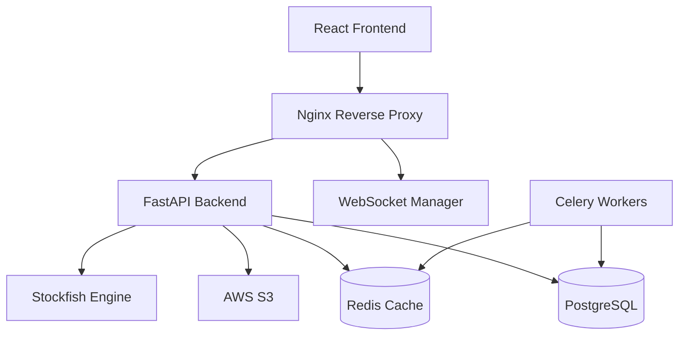
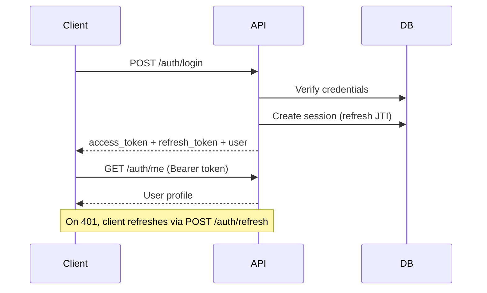

# ChessMaster Pro — Architecture

## System Overview



## Backend Layers (Clean Architecture)

```
app/
├── api/v1/       # HTTP route handlers
├── core/         # Config, security, database, dependencies
├── models/       # SQLAlchemy ORM models
├── schemas/      # Pydantic request/response DTOs
├── services/     # Business logic
├── repositories/ # Data access (Phase 2+)
├── websocket/    # Real-time events (Phase 2+)
└── tasks/        # Celery background jobs (Phase 2+)
```

## Database Schema (Phase 1)

- `users` — authentication, roles, OAuth
- `profiles` — ratings, stats, avatar
- `sessions` — refresh token tracking
- `games` — game state, FEN, PGN
- `moves` — move history
- `notifications` — in-app alerts
- `audit_logs` — security audit trail

## Authentication Flow


